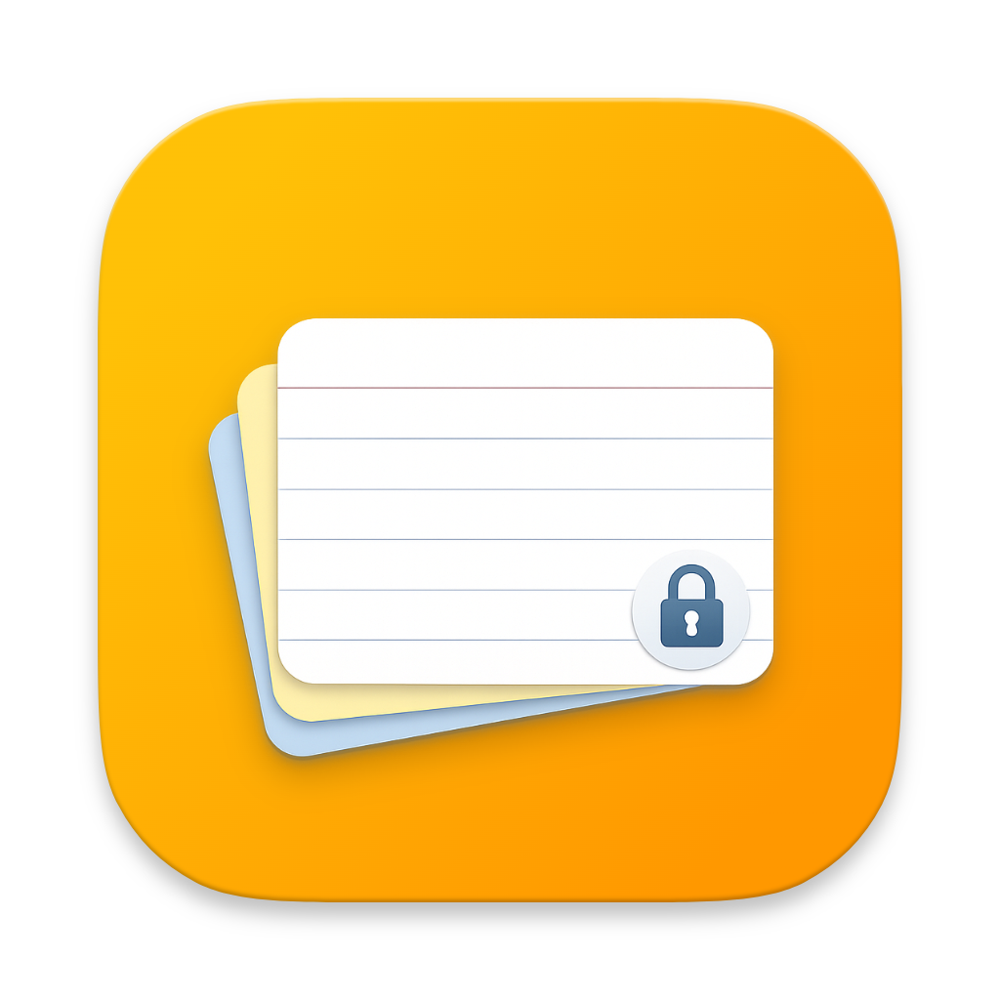

# NoteCard

**中文** · [English](#english)

一个轻量的本地卡片笔记工具，告别桌面一堆 txt。

---

## 简介

`密码.txt`、`临时记一下.txt`、`新建文本文档(3).txt`……每次找东西都要挨个翻，这件事该结束了。

NoteCard 把所有碎片记录——密码、账号、备忘、临时想法——统一放进一个 `.ncard` 文件，按类别整理，一眼找到。

极致轻量，启动即用，关闭不驻留。没有后台进程，不占内存，不拖慢系统。

## 功能

- 📋 **卡片式管理** — 按类别分组，支持拖拽排序
- 🔒 **分级加密** — 可对单张卡片或整个类别独立加密，其余内容照常展示
- 🔍 **快速搜索** — 实时搜索所有卡片内容
- 🎨 **卡片配色** — 为不同卡片设置颜色标记
- 🌍 **多语言** — 支持简体中文、繁体中文、English、日本語
- 🔄 **自动更新** — 安装版启动后自动检测新版本
- 💾 **纯本地** — 无云同步、无账号、无数据上传，文件在哪数据就在哪

## 下载

前往 [Releases](https://github.com/Ja1nHan/Notecard/releases/latest) 下载最新版本：

| 文件 | 说明 |
|------|------|
| `NoteCard_*_x64-setup.exe` | [安装版，支持自动更新](https://github.com/Ja1nHan/Notecard/releases/latest) |
| `NoteCard_*_x64_portable.zip` | [便携版，解压即用，无需安装](https://github.com/Ja1nHan/Notecard/releases/latest) |

> **便携版使用方式**：解压后直接运行 `NoteCard.exe`，数据跟随 `.ncard` 文件存放，可放在 U 盘随身携带。

## 文件格式

NoteCard 使用 `.ncard` 文件存储所有数据。文件为 JSON 格式，无加密内容时可直接阅读；有加密内容时，仅加密部分经过 AES-256-GCM 加密，其余明文保存。

---

[中文](#readme) · **English**

A lightweight local card-based note manager. Replace the pile of `.txt` files on your desktop.

## Introduction

`passwords.txt`, `temp-notes.txt`, `New Text Document (3).txt`… Stop hunting through files every time you need something.

NoteCard puts all your fragmented records — passwords, accounts, memos, quick thoughts — into a single `.ncard` file, organized by category, visible at a glance.

Lightweight by design. Opens instantly, leaves no background process when closed.

## Features

- 📋 **Card-based layout** — Organize by category, drag to reorder
- 🔒 **Granular encryption** — Encrypt individual cards or entire categories independently
- 🔍 **Instant search** — Real-time search across all card content
- 🎨 **Color labels** — Assign colors to cards for quick visual identification
- 🌍 **Multilingual** — Simplified Chinese, Traditional Chinese, English, Japanese
- 🔄 **Auto update** — Installed version checks for updates on launch
- 💾 **Local only** — No cloud sync, no account, no data upload

## Download

Visit [Releases](https://github.com/Ja1nHan/Notecard/releases/latest) for the latest version:

| File | Description |
|------|-------------|
| `NoteCard_*_x64-setup.exe` | [Installer with auto-update support](https://github.com/Ja1nHan/Notecard/releases/latest) |
| `NoteCard_*_x64_portable.zip` | [Portable, no installation required](https://github.com/Ja1nHan/Notecard/releases/latest) |

> **Portable usage**: Extract and run `NoteCard.exe` directly. Works from a USB drive.

## Tech Stack

- [Tauri v2](https://tauri.app/) — Rust backend, minimal memory footprint
- [React](https://react.dev/) + [TypeScript](https://www.typescriptlang.org/)
- AES-256-GCM encryption via Rust

## License

[MIT](LICENSE)
